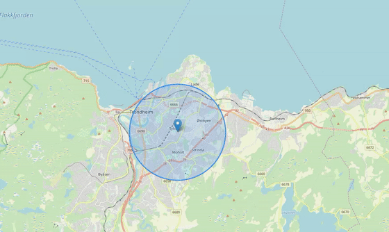

# Cell Geolocation Helpers 

Helper functions for the cell geolocation feature.

## Installation

    npm i --save-dev --save-exact @nordicsemiconductor/cell-geolocation-helpers

## `cellId`

Simple formatter to create identifier strings from cell information. This is
used to unify the way these ids are generated between frontend and backend.

## `cellFromGeolocations`

_(Demo and above GIF are using 5km min cell radius and P=0.9.)_

Calculates a cell geo location based on a list of geo locations:

- the center is the average of all given locations (within a configurable
  percentile)
- the diameter returned is a circle that includes all given locations (within a
  configurable percentile), but at least `minCellDiameterInMeters`.

Check out the live demo on
<https://nordicsemiconductor.github.io/cell-geolocation-helpers-js>.
